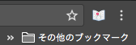

Read Ruby
====

Webページの英単語の上(ルビ)に意味を表示させるGoogle Chrome拡張です。

利用者のレベルに応じて表示する単語の難易度を選択することができます。

## Install
Read Ruby -Chrome ウェブストア

## Develop
`yarn`

#### Watch

`gulp watch`

#### Build
`gulp build`

## Usage
英単語の意味を表示させたいサイト上で、ツールバーのアイコンをクリックしてください。

下のようなページが

このようになります。

アイコンをもう一度クリックするとルビを消すことができます。

またツールバーのアイコンのオプションから表示する単語の難易度を設定することができます。

## Dependency
英日辞書にMITライセンスの[簡短英日辞典](https://github.com/gunyarakun/kantan-ej-dictionary)を使用しています。

## Licence
MIT

## Author

[drilldripper](https://github.com/DrillDripper)