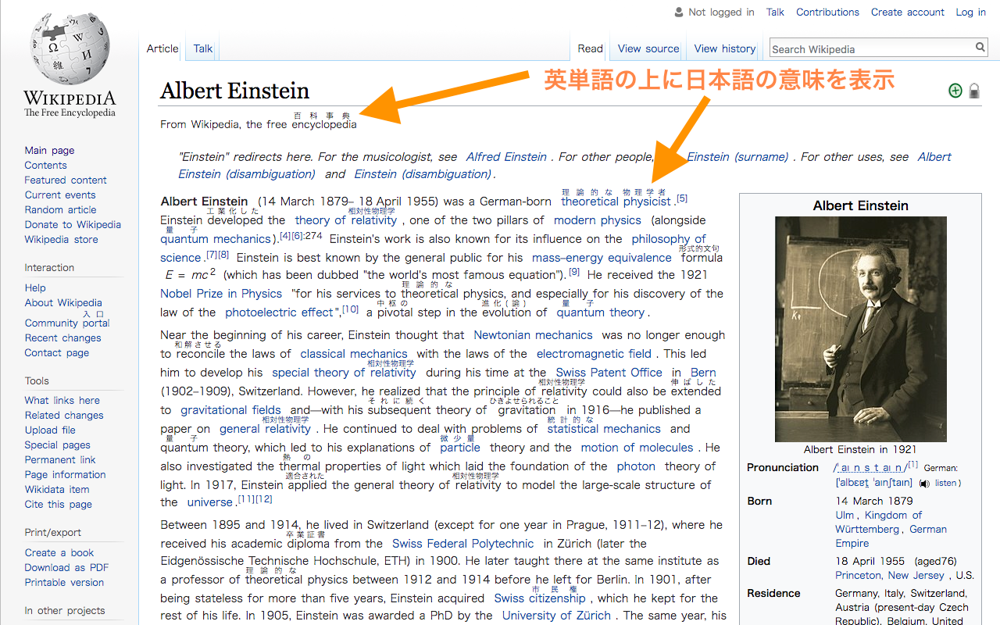
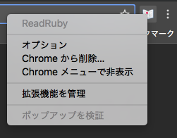
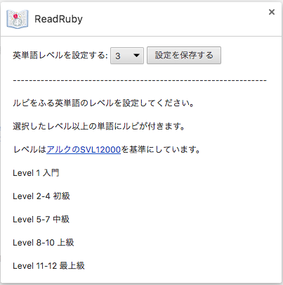

Read Ruby
====

  

ウェブページの英単語に単語レベルを指定して日本語訳のルビをつけるGoogle Chrome拡張機能です。

## Install
[Read Ruby -Chrome ウェブストア](https://chrome.google.com/webstore/detail/read-ruby/halocbmjecniinhbckbcgcpiepokahak?hl=ja)

## Usage

英単語の意味を表示させたいサイト上で、ツールバーのアイコンをクリックしてください。

アイコンをもう一度クリックすると表示/非表示を切り替えることができます。

ツールバーのアイコンを右クリックしてオプションを選択すると、単語のレベルを設定できます。

## Develop
### Dependency
`yarn`

#### Watch

`gulp watch`

#### Build
`gulp build`

## Dependency
英日辞書にMITライセンスの[簡短英日辞典](https://github.com/gunyarakun/kantan-ej-dictionary)を使用しています。

## Licence
MIT

## Author

[drilldripper](https://github.com/DrillDripper)