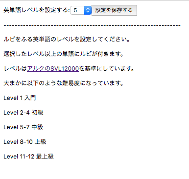

Read Ruby
====

Webページの英単語の上(ルビ)に意味を表示させるGoogle Chrome拡張です。

利用者のレベルに応じて表示する単語の難易度を選択することができます。

## Install
[Read Ruby -Chrome ウェブストア](https://chrome.google.com/webstore/detail/read-ruby/halocbmjecniinhbckbcgcpiepokahak/related?hl=ja)

## Develop
`yarn`

#### Watch

`gulp watch`

#### Build
`gulp build`

## Usage
英単語の意味を表示させたいサイト上で、ツールバーのアイコンをクリックしてください。

アイコンをクリックすると下のようなページが

このようにルビ付きのページになります。

アイコンをもう一度クリックすると表示/非表示を切り替えることができます。

またツールバーのアイコンのオプションから表示する単語の難易度を設定することができます。

## Dependency
英日辞書にMITライセンスの[簡短英日辞典](https://github.com/gunyarakun/kantan-ej-dictionary)を使用しています。

## Licence
MIT

## Author

[drilldripper](https://github.com/DrillDripper)